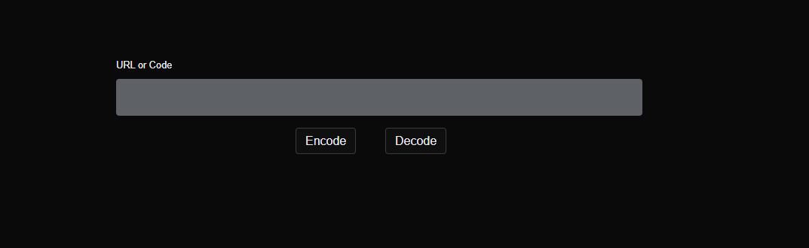

# Encode and Decode URL

<p align="center">
  
</p>

## Encode
Encodes an URL into 6 character string

## Decode
Decodes a 6-character string back to the URL

</br>
> URL is persisted for a period of 30 days

## Development

* ### Local 
```bash
pip install -r requirements.txt
streamlit run main.py
```
* ### Docker
```bash
docker-compose up 
```
* ### Dashboard can be accessed at 
```URL
http://localhost:8501/
```
